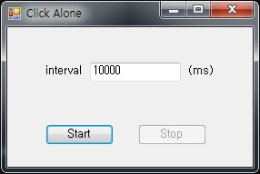

# ClickeAlone
.NET Framework 4.5

입력한 interval에 따라 반복적으로 마우스가 위치한 곳에 click event를 발생 시킨다.

"왜 이딴걸 만들었을까?" 생각하겠지만 화면보호기가 설치된 PC에서 running time이 긴 작업을 하는 경우

화면이 잠기지 않게 하기 위해서 개발하였다. 

개발 긴 고민 없이 짧게 생각하고 빠르게 만들었고 유용하게 잘 사용했었다.

하지만 지금와서 생각해 보면 뭐 이딴걸 만들었을까 싶다.

지금은 간단하게 stayawake(https://mlesniew.wordpress.com/stayawake/)를 사용하면 된다.

